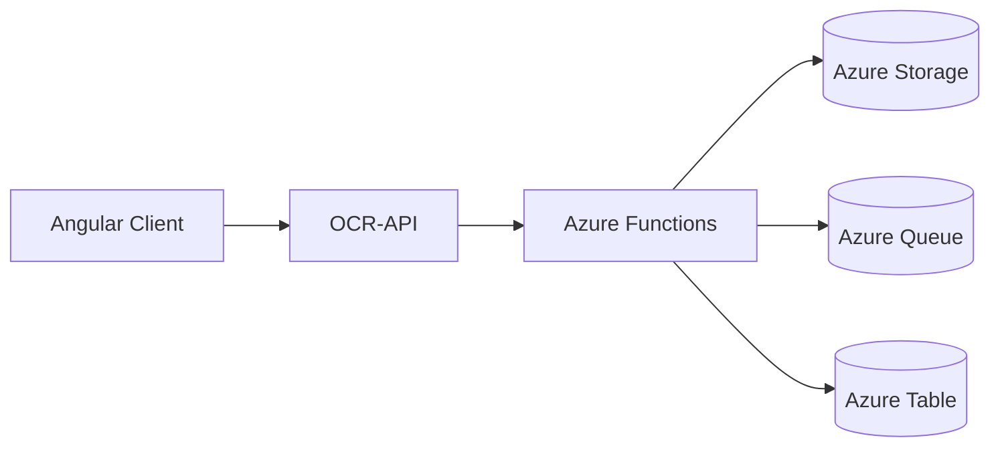
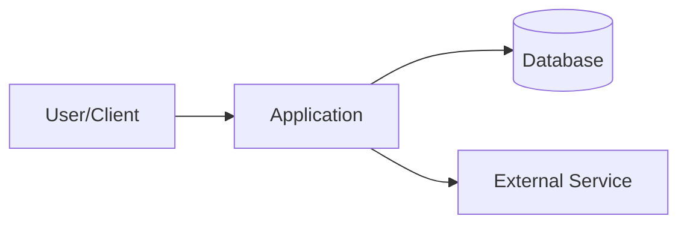
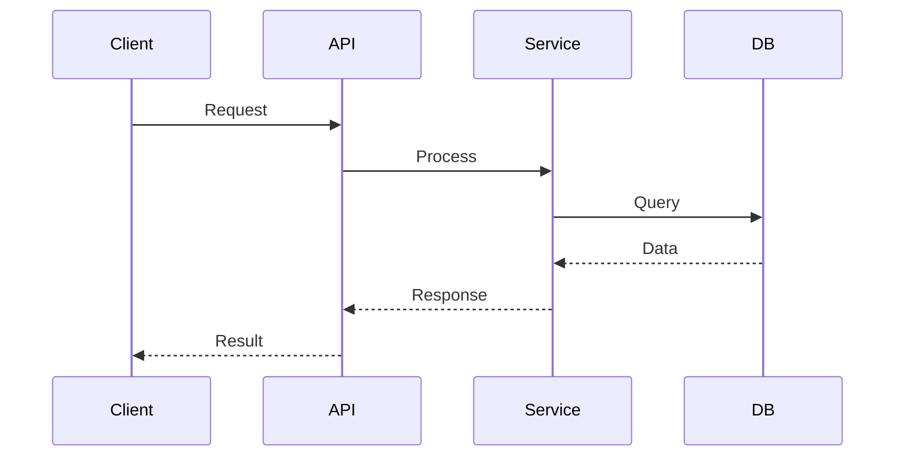

---
# context.md — Workspace Reverse‑Engineering Orchestrator

description: |-
  Orchestrates reverse‑engineering across a workspace by scanning all
  repositories, excluding any whose names end with `-document`, and generating a
  single file named `project-context.md` in each eligible repository.

handoffs:
  - label: Build Specification
    agent: speckit.specify
    prompt: >-
      Use the generated `project-context.md` as the foundation for feature
      specification.

---

## 0) Purpose & Contract
This workflow operates in a brownfield environment. The objective is to collect
architectural, structural, and operational knowledge from each repository in the
workspace (excluding those ending in `-document`) and consolidate it into a
single Markdown file named:

```
<repo-root>/project-context.md
```

**Workspace Architecture**:
- **Multi-repo**: `*-document` repositories are excluded because they hold planning artifacts
  (.specify/ directory) but no source code. This command generates `project-context.md` in
  implementation repositories that contain actual code.
- **Single-repo**: Generates `project-context.md` at repository root alongside source code.

Do **not** create additional files.
Do **not** modify source code.

### Source Detection Requirement
This workflow **MUST execute only if source code is detected** in the repository.
A repository qualifies as containing source code if **any** of the following are present:
- A build or project file (e.g., `*.csproj`, `package.json`, `angular.json`)
- Entry-point files (e.g., `Program.cs`)
- Source directories (e.g., `src/`)

If **no source code** is detected, **skip the repository**.

---

## 1) Workspace Traversal
1. Detect all repositories in the workspace.
2. Exclude repositories whose names match the pattern `*-document` (these contain planning artifacts, not source code).
3. For each remaining repository, check for **source code presence**.
4. If source code exists, apply the reverse‑engineering process.
5. If **no source code is detected**, skip the repository and note this in
   the final summary under **"Skipped (No source detected)"**.
   - **Single-repo scenario**: If only one repository exists and it contains source, treat as single-repo and generate `project-context.md` at root.
6. If `<repo-root>/project-context.md` already exists, ask the user for
  confirmation before overwriting:
  - Prompt: `project-context.md already exists in <repo>. Overwrite? (Y/N)`
  - `Y`: proceed with overwrite.
  - `N`: skip writing for that repository.
  - Any non-`Y` response: treat as `N`.
  - Record skipped repositories in final summary under
    **“Skipped (Overwrite not approved)”**.
7. For repositories that reference each other:
   - Detect cross‑repository relationships.
   - Document these relationships **briefly** in each corresponding
     `project-context.md`.
   - Do **not** duplicate documentation. Summarize and reference only.

---

## 2) Per‑Repo Execution Flow

### 2.1 Source Discovery
Identify characteristics of the repository based on its structure, including:
- Languages and frameworks detected
- Project layout and modules
- Build systems and configurations

### 2.2 Architectural Understanding
Document:
- The primary purpose of the repository
- Logical components, layers, and interactions
- Relevant integrations
- Deployment or hosting context if identifiable

### 2.3 Diagram Generation
**Generate actual Mermaid diagrams** to illustrate architecture and workflows.

Required diagram types:
- **System Context** (Section 1): High-level overview showing system boundaries and external integrations
- **Architecture/Data Flow** (Section 3): Component interactions and data movement
- **Sequence Diagrams**: Key workflows or request flows (where applicable)

Diagram requirements:
- Use standard Mermaid syntax (flowchart, sequenceDiagram, classDiagram, etc.)
- Keep diagrams focused and readable (max 10-15 nodes for flowcharts)
- Label relationships clearly
- Use consistent naming conventions
- Wrap in proper Mermaid code blocks: ` ```mermaid ... ``` `
- **Generate diagrams based on actual repository analysis**, not generic templates

Example system context diagram:


### 2.4 Code Quality Signals
Capture observable indicators, including:
- Test presence and locations
- Linting and formatting configurations
- CI/CD automation indicators

### 2.5 Consolidated Output Rule
Produce **one** output file only:
```
<repo-root>/project-context.md
```
No additional files or directories.

---

## 3) Required Content for `project-context.md`
Each generated file must include the following sections. If a section does not
apply, include the heading with a short explanation.

0. TL;DR
1. System Overview
2. Repo Summary
3. Architecture & Data Flow
4. Tech Stack
5. Configuration & Environments
6. Domain Model
7. API & Integration Surfaces
8. UI/Frontend (if applicable)
9. Local Development
10. Testing Strategy
11. Observability & Operations
12. Security & Privacy
13. Feature Integration Guidance
14. Dependencies
15. Component Inventory
16. Files Referenced
17. Open Questions
18. Guardrails & Non‑Goals
19. Quick Start Example
20. Changelog

**Generate Mermaid diagrams** for sections that benefit from visual representation (typically sections 1, 3, and optionally 7).

---

## 4) Authoring Conventions
- Markdown only
- Generate Mermaid diagrams using proper code block syntax: ` ```mermaid ... ``` `
- No secrets or sensitive data
- Keep text clear and concise
- Use ISO date formats
- Reference only files relevant to the repository

---

## 5) Quality Gates

### 5.1 Pre-Generation Validation
Before generating content for each phase:
- Ensure all required sections for that phase have been planned
- Verify no `[TBD]` placeholders will be used
- Confirm no sensitive information will be included

### 5.2 Per-Phase Validation
After generating content for each phase:
- Verify all assigned sections are complete
- Ensure Mermaid diagrams use valid syntax and render correctly
- Check section numbering matches template
- Confirm diagrams are relevant and accurately represent the architecture

### 5.3 Final Validation
After completing all 5 writing phases:
- Confirm all 21 sections (0-20) are present
- Verify file structure matches template
- Ensure no sensitive data was written

---

## 6) File Output Rules

### 6.1 File Location & Confirmation
- Write to: `<repo-root>/project-context.md`
- If file exists, require per-repo user confirmation (`Y/N`) before overwrite
- If overwrite is not approved, do not write the file for that repository

### 6.2 Phased Writing Strategy
To ensure reliability and prevent context overflow, write the file incrementally:

**Pre-Write Phase:**
1. If `project-context.md` exists and user approved overwrite:
   - Create backup: `project-context.md.backup.YYYYMMDD_HHMMSS` (use current timestamp)
   - Delete the original `project-context.md`
   - Create new empty `project-context.md`

**Writing Phase:**
Write content in **5 sequential phases** (do not attempt to write all sections at once):

- **Phase 1**: Write sections 0-4 (TL;DR through Tech Stack)
- **Phase 2**: Write sections 5-8 (Configuration through UI/Frontend)
- **Phase 3**: Write sections 9-12 (Local Development through Security)
- **Phase 4**: Write sections 13-16 (Feature Integration through Files Referenced)
- **Phase 5**: Write sections 17-20 (Open Questions through Changelog) + Appendix

Each phase must:
1. Generate content for assigned sections only
2. Append to `project-context.md` using atomic write operation
3. Verify write succeeded before proceeding to next phase
4. If write fails, stop and report error with phase number

**Post-Write Phase:**
1. Verify complete file contains all 21 sections (0-20)
2. If verification passes: 
   - **Delete the backup file** `project-context.md.backup.YYYYMMDD_HHMMSS` (use file deletion operation)
   - Confirm deletion succeeded
3. If verification fails: 
   - Restore from backup by copying `project-context.md.backup.YYYYMMDD_HHMMSS` to `project-context.md`
   - Report error with details

### 6.3 Encoding & Format
- Use UTF‑8 encoding
- End file with newline
- Preserve Markdown formatting

### 6.4 Error Handling
- If any phase fails: keep backup, report specific phase and error
- If backup creation fails: abort and do not proceed with overwrite
- If restoration needed: copy backup back to `project-context.md`

---

## 7) Template Inserted Into Each Repository
````markdown
# Project Context — <Repo Name>

> Purpose: A single document providing enough context for a contributor or agent
> to understand and safely extend this repository.

---

## 0) TL;DR
Brief summary of the repository’s purpose and key conventions.

---

## 1) System Overview



*Replace with actual system context diagram showing components and boundaries.*

---

## 2) Repo Summary
- Primary technologies
- Main directories
- Responsibilities

---

## 3) Architecture & Data Flow



*Replace with actual architecture/workflow diagram relevant to this repository.*

---

## 4) Tech Stack
Technologies used in this repository.

---

## 5) Configuration & Environments
Summary of configuration files and environment settings.

---

## 6) Domain Model
Entities, DTOs, interfaces, and enums.

---

## 7) API & Integration Surfaces
Endpoints and integration boundaries.

---

## 8) UI/Frontend (if applicable)
Components, modules, routing.

---

## 9) Local Development
Commands required to work with the project.

---

## 10) Testing Strategy
Test frameworks, locations, and execution commands.

---

## 11) Observability & Operations
Logging, telemetry, operational conventions.

---

## 12) Security & Privacy
Authentication patterns, sensitive data handling.

---

## 13) Feature Integration Guidance
Where to add new functionality and common extension patterns.

---

## 14) Dependencies
Detected external and internal dependencies.

---

## 15) Component Inventory
List major components and their responsibilities.

---

## 16) Files Referenced
List of significant files examined during analysis.

---

## 17) Open Questions
Unresolved or uncertain aspects.

---

## 18) Guardrails & Non‑Goals
Explicit constraints not to violate.

---

## 19) Quick Start Example
How to add a new feature.

---

## Appendix: Changelog
- <YYYY‑MM‑DD> — Initial generation
````

---

## 8) Completion Summary Output
At the end of processing the workspace, output:
```
Reverse‑engineering summary
- Repositories scanned: <N>
- Excluded (matches *-document): <K>
- Skipped (No source detected): <M>
- Skipped (Overwrite not approved): <P>
- Successfully written:
  - <repo1>/project-context.md (5/5 phases)
  - <repo2>/project-context.md (5/5 phases)
- Failed writes (if any):
  - <repo3>/project-context.md (failed at phase X: <error>)
```
